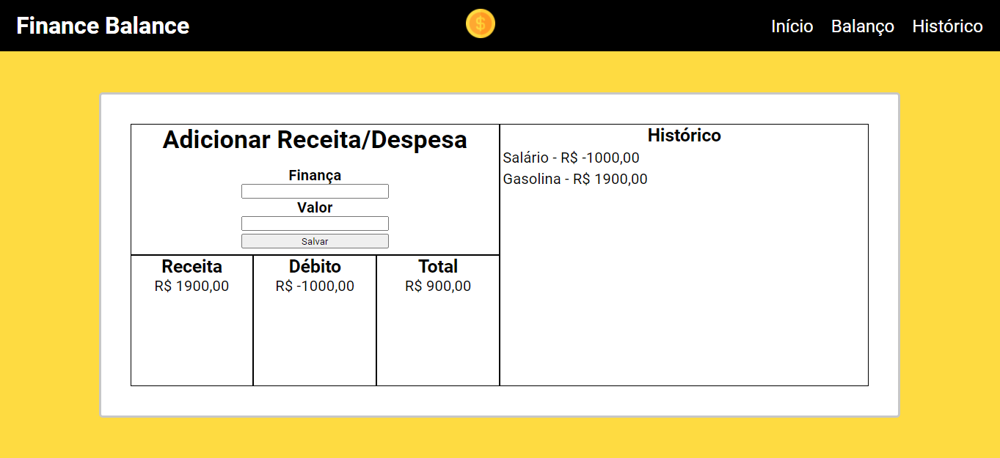

# financy-balance

A project made to make easier your financy, with a simple and responsible layout.

## Features that we'll see along the project

- Create a new and different layout, including animation, menu (hamburguer).
- Improve HTML, CSS, JS and DOM manipulation skills.
- Adapt the website with a responsive layout, using flex-box or grid including media queries.

## What's left to do?
- Create the containers who will receive the right function and layout
- put some animation in navbar
- use some css properties to make a nice layout
- create a footer

## Show Project

